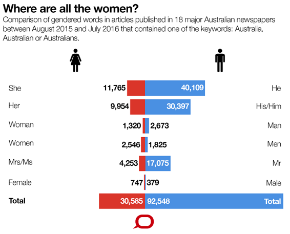
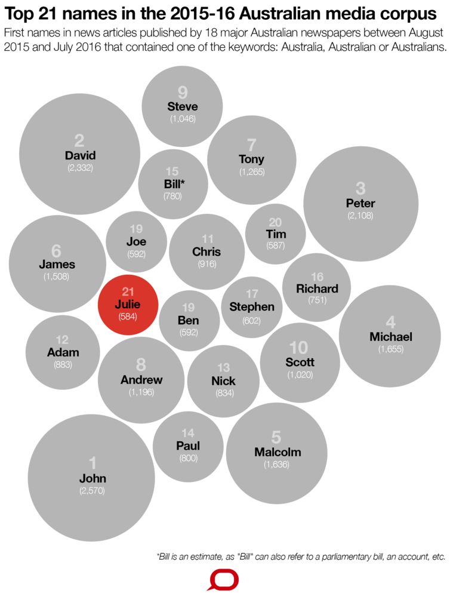

# Last examples...
Now that you have all concordanced and used collocations, here is an example of the kind of research you can conduct.

> ‘He’ vs ‘she’ in Australian media coverage: what the language of news tells us about gender imbalance (Lukin 2016)

Annabel Lukin used a corpus of 18 Australian newspapers over a 12 moth period from August 2015 to July 2016 -- consisting of nearly 13,000 articles and close to 7.4 million words -- to examine what news discourse can tell us about gender imbalance. The corpus complied by linguists at Lancaster University’s Corpus Approaches to Social Science Research Centre showed that the ratio of “he” to “she” in Australian news reporting is 3.4 to 1.

In any large set of text, the most frequent words are always the smallest - words such as “the”, “and”, “a”, etc... *"But not too far down this list is the male pronoun: “he”".* In fact, 'he' was the 16th most frequently used word. By comparison, the female equivalent 'she' was number 66 on the list.

*"If you are a “he” or “she” in a text, it means you have a prominent grammatical role - you are the subject of the clause, and you have lasted long enough in the story to graduate from proper name to pronoun.
We can also examine the frequency of combinations of words, like “he said” versus “she said”. Of the articles in the corpus, “he said” appeared 9,892 times compared to “she said” at 2,709 – a ratio of roughly 3.6 to 1. That tells us something important about whose voices are heard in Australian news media."*

Additionally, the use of proper nouns is also a good indicator of gender balance. It takes 20 names in the corpus before we reach a female name (Julie Bishop was Australia's foreign minster during the period).

I tweeted Dr Annabelle Lukin and she revealed that she used a simple concordancing program to produce this insightful public research.  