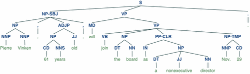

# The Natural Language Toolkit
NLTK is a Python Library for working with written language data. 
It is free, open source and [well documented](http://www.nltk.org/). 
NLTK began its life in 2001 as a project of Steven Bird and Edward Loper. At the time, Bird was a professor in computational linguistics at the University of Pennsylvania and Loper, his star student. 
Together they agreed on a plan for developing software infrastructure for NLP teaching that could be easily maintained over time. 

That software infrastructure became NLTK. 
The toolkit supports at least 40 different languages and is now used in university courses around the world.
The book [*Natural Language Processing with Python*](http://www.nltk.org/book/) (2009), written by Steven Bird, Edward Loper and their collaborator Ewan Klein, has been cited at least 461 times. This literature covers the gamut of disciplines, from computer science to the social sciences, engineering, mathematics, medicine, biochemistry and genetics to business, management and accounting, to name only a few. 

> Note: NLTK provides tools for tasks ranging from very simple (counting words in a text) to very complex (writing and training parsers, etc.). Many advanced tasks are beyond the scope of this chapter

Many areas covered in this chapter are covered in more detail in the [NLTK Book](http://www.nltk.org/book/). Some of the tasks NLTK can help you with include; tokenization (turning words into discrete data), stemming (removal of derivational affixes e.g. 's' 'ed', 'ing'), lemmatization (grouping together different forms of a word, e.g. walk, walks, walking, as a single item), tagging (with parts-of-speech, for e.g) and parsing (creating a parse tree, for e.g.). The example below is a parse tree, which includes parts-of-speech tags (S = sentence, NN = noun, etc...).

```python
from nltk.corpus import treebank #from the nltk corpus import the treebank function.
t = treebank.parsed_sents('wsj_0001.mrg')[0] #save the 'parsed' sents (sentences) from the Wall Street Journal as the 'variable' t 
t.draw() #draw t (see output below)
```



(Figure 1. Parse tree, Bird et al. 2009)

Variables, in computer programming, are a storage location paired with an associated symbolic name (an identifier), which contains some known or unknown quantity of information referred to as a value. In this case 't' is a variable that saves the parsed sentences as a treebank.

The data we will be working with later has already had some processing done on it so that we will be able to use NLTK to find features of the language. However, in general, Python regards a text file as a single long string of characters. Tokenization breaks text into sentences and words that the computer can understand as discrete units. Here is an example of one of NLTK's tokenizers at work:

```python
sentence = "They refuse to permit us the refuse permit"
words = word_tokenize(sentence)
tagged = nltk.pos_tag(words, tagset='universal')
print(tagged)
```

    [('They', u'PRON'), ('refuse', u'VERB'), ('to', u'PRT'), ('permit', u'VERB'),
    ('us', u'PRON'), ('the', u'DET'), ('refuse', u'NOUN'), ('permit', u'NOUN')]


Part of Speech tagging creates bigrams; it associates the word with its tag in a pair of items that we can see above in brackets. We can also observe that each word is now an item in a list, as opposed to the original sentence in quotation marks, separated only by spaces. A list in computer programming is an abstract data type  that represents a countable number of ordered values.
