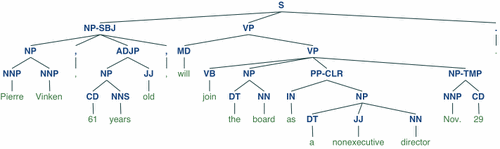

# The Natural Language Toolkit
NLTK is a Python Library for working with written language data. It is free, open source and [well documented](http://www.nltk.org/). Many areas covered in this chapter are covered in more detail in the [NLTK Book](http://www.nltk.org/book/). Some of the tasks NLTK can help you with include; tokenization (turning words in discrete data), stemming (removal of derivational affixes e.g. 's' 'ed', 'ing'), tagging (with parts-of-speech, for e.g) and parsing (creating a parse tree, for e.g.). The example below is a parse tree, which includes parts-of-speech tags (S = sentence, NN = noun, etc...).

(Figure 1. Parse tree, Bird et al. 2009)

NLTK began its life in 2001 as a project of Steven Bird and Edward Loper. At the time, Bird was a professor in computational linguistics at the University of Pennsylvania and Loper, his star student. Together they agreed a plan for developing software infrastructure for NLP teaching that could be easily maintained over time. 

That software infrastructure became NLTK. The toolkit supports at least 40 different languages and is now used in university courses around the world. The book *Natural Language Processing with Python* (2009), written by Steven Bird, Edward Loper and their collaborator Ewan Klein, has been cited at least 461 times. This literature covers the gamut of disciplines, from computer science to the social sciences, engineering, mathematics, medicine, biochemistry and genetics to business, management and accounting, to name only a few. 

The toolkit is built on the theoretical framework and literature of computational linguistics.

> maybe cut below....

One linguistic theory is *Systemic Functional Linguistics*, developed by Michael Halliday (Prof. Emeritus at University of Sydney).

This approach to linguistics understands language as a social semiotic system, examining how *realized language* (lexis and grammar) work to achieve meaningful social functions.

Central to this theory is a division between *experiential meanings* and *interpersonal meanings*. Experiential meanings communicate what happened to whom and under what circumstances. Interpersonal meanings negotiate identities and role relationships between speakers. 

Halliday argues that these two kinds of meaning are realized *simultaneously* through different parts of English grammar. Experiential meanings are made through *transitivity choices*, while interpersonal meanings are made through *mood choices*.

Transitivity choices combine different configurations of participants (*a woman, pink unicorns*), processes (*sleep, has always been, is considering*) and circumstances (*on the weekend*, *in Australia*).

Mood features of a language include: mood types (*declarative, imperative, interrogative*), modality (*could, can, might*) and lexical density i.e. the number of words per clause, the number of content to non-content words, etc...