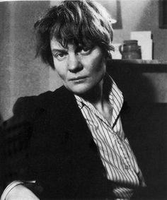
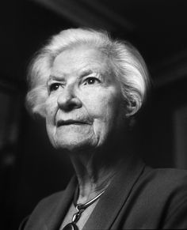

# Example: Dementia

> Longitudinal detection of dementia through lexical and syntactic changes in writing: a case study of three British novelists (Le et al. 2011)

Perhaps you recognize these women?

I'll give you a clue, they are all English Novelists

Iris Murdoch (first on the left) is best known for her novels concerning good and evil, sexual relationships, morality, and the power of the unconscious. Murdoch was diagnosed with Alzheimer's disease in 1997 and, sadly, died two years later in 1999.

Agatha Christie (middle) the famous murder mystery author, long suspected of having the disease, but never diagnosed.

P. D. James (right), a crime novelist who, by all reports, lived a long and health life.

The study bought together a multidisciplinary team; two computer scientists, an English professor and a speech-language pathologists, all from the University of Toronto.

They undertook a large-scale longitudinal study of lexical and syntactic changes in language, using as their subjects the British novelists mentioned above. Specifically, they used lemmatized the the plain text file of a novel with NLTK WordNet's *morphy* method (Le et al. 2011: 439). 

> Do I need to go into more detail about how nltk was used? (it's a bit technical).

Their results support the hypothesis that signs of dementia can be found in diachronic analyses of patients’ writings.

> you need to find a way to extract and insert the graphics on the results from the paper in here.

In particular, they found that it is probable that Agatha Christie indeed suffered from the onset of Alzheimer's while writing her last novels. Likewise, Iris Murdoch exhibited a ‘trough’ of relatively impoverished vocabulary and syntax in the writing of her late 40s and 50s that presaged her dementia.

 

